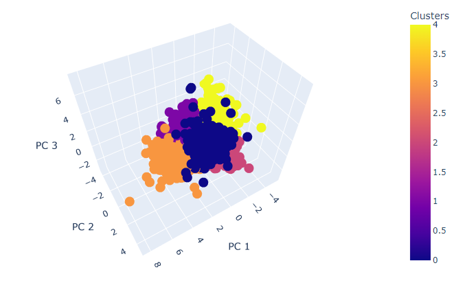
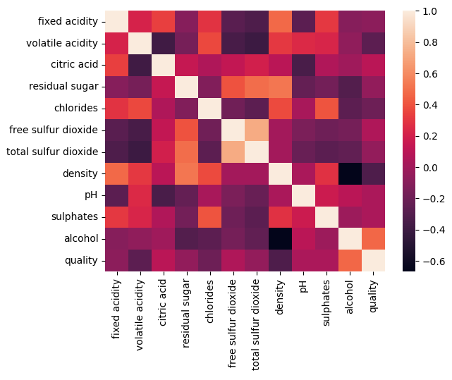
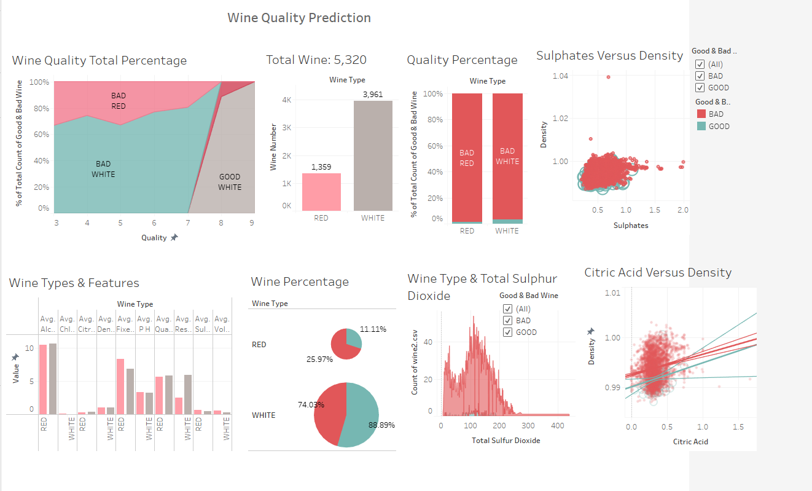
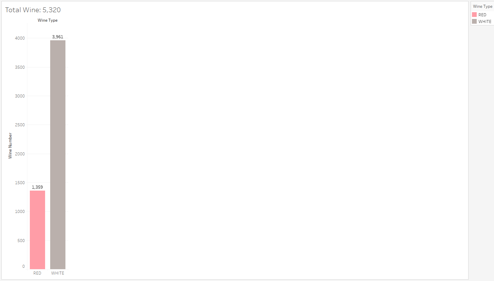
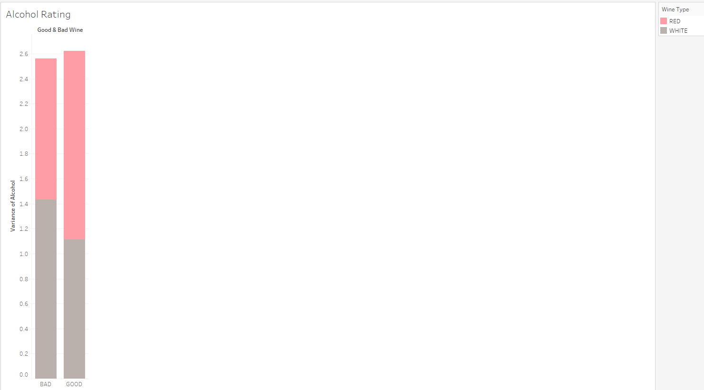
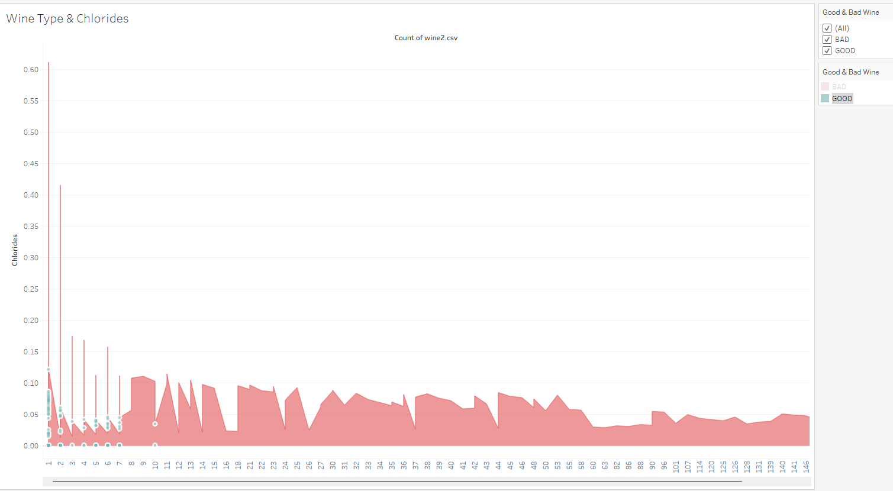

# Read Between the Wines

## Overview

This analysis explored red and white wine datasets to predict quality and type based on physiochemical properties (physical and chemical characteristics).  This could potentially be useful to restauranteurs when choosing new wines for their restaurant based on the label. Our goal was to have a model with at least 80% accuracy.

## Process & Results

### Our Question

 Can quality score (0-10) of both red and white wines be predicted using a combination of the following features with at least 80% accuracy?
  
- fixed acidity
- volatile acidity
- citric acid
- residual sugar
- chlorides
- free sulfur dioxide
- total sulfur dioxide
- density
- pH
- sulphates
- alcohol

### Exploratory Data Analysis (EDA)

#### K-means

Red and White datasets were read into dataframes for EDA which included:

- checking headers and ensuring that dataframes were compatible
- checking datatypes
- checking for null values
- finding and removing duplicate entries
- adding a "type" column to the dataframes
- performing counts
- joining the dataframes by .append
- checking for unique values
- generating a correlation table
- exploring data using visualizations
- scaling the combined data and performing PCA
- performing exploratory Kmeans analysis
- determining if meaningful clustering could be achieved

Meaningful clustering was not achieved.

<figcaption align = "center"><b>K-Means Wine Clusters</b></figcaption>

We attemped to explore each dataset individually as above, with a similar result.

<figcaption align = "center"><b>K-Means Red Wine Cluster</b></figcaption>

<figcaption align = "center"><b>K-Means White Wine Cluster</b></figcaption>

##### Clustering Outcome

Clustering wasn't effective when trying to determine the quality rating 0-10.

#### Classification

Further data exploration was completed using a RandomForestClassifier.  The datasets were examined individually first.

- Duplicates were dropped.
- Features and target (quality) were defined.
- Data was split into training and testing.
- A standard scaler was used to scale the data.
- Scaled data was fit to a RandomForest Classifier.
- Predictions were made, a confusion matrix was generated, and classification report  run.
- The red predictions were estimated to have ~60% accuracy
- The white predictions were estimated to have ~52% accuracy
- A booster (EasyEnsembleClassifier) was used in an attempt to increase accuracy, but it actually decreased for both wine types.
- Features were ranked by importance for each data set

The top 5 overlapping features were noted and the dataframe was reduced to only those features for the combined dataset.

- The same steps were taken as above, but no booster was attempted.
- The resultant accuracy score was ~53%.

##### Classification Outcome

Classification wasn't effective when trying to determine the quality rating 0-10.

### A New Question

After the road blocks with our data noted above, we needed to change our question based on what we learned.  We noted that the features that rated a better quality score were very different for reds and whites and even differed enough internally that the models' accuracy suffered.  Models had a really hard time predicting the ratings 5-6, and that is where the majority of the data fell.  Time to rethink our question.

Can we predict "Good" wine?  

Our group chose to rank the wines as "Good" or "Bad" by applying conditions.

### Preprocessing

Preprocessing included:

- The red and white data sets were combined and read into a dataframe.
- Duplicates were dropped.
- Wines with a rating of greater than or equal to 7 were classified as "Good" (0) and less than 7 were given a "Bad" (1) rating.
- Features and target (quality) were defined.
- Data was split into training and testing.
- A standard scaler was used to scale the data.

### Quality Model

- Scaled data was fit to a RandomForest Classifier.
- Predictions were made, a confusion matrix was generated, and classification report run.

<figcaption align = "center"><b>Quality Prediction Confusion Matrix</b></figcaption>

- Features were ranked by importance for this model.

<figcaption align = "center"><b>Quality Prediction Feature Importance</b></figcaption>

### Additional Analysis

When we noted the differences between the wine types as related to quality, it was suggested that we may be able to predict the wine type based upon the physiochemical feature differences.

### Type Model

- Preprocessing was performed as in the above model with 2 exceptions:

  - The target was "type"
  - Conditions were not applied to determine "good" or "bad".

<figcaption align = "center"><b>Wine Type Prediction Confusion Matrix</b></figcaption>

<figcaption align = "center"><b>Wine Type Prediction Feature Importance</b></figcaption>

<figcaption align = "center"><b>Wine Type Prediction Feature Importance</b></figcaption>

## Discussion

We chose to use supervised learning because our data was labeled and had a smaller amount of variables.  We chose a classification model to label our output as "good" or "bad".  The only statistics calculated in this project are the classification report and include accuracy, precision, sensitivity, and F1. We also evaluated feature correlation during EDA.

Our original goal for the Quality Model sensitivity was 80%.  Our current model will be accurate a projected ~85% of the time.  It is more sensitive for the detection of "Bad" wines at 95%, but the low score(~40%) may indicate some false negatives in the "Good" category.  The F1-score is supportive of using this model with a higher score of 83%.

The Type Model will be accurate a projected ~99% of the time.  It rates high for sensitivity, precision, and F1-score. With a model rating this high, there was a concern for data leakage skewing the model.  A correlation table was generated and the highest correlation seen was ~69% which did not indicate that data leakeage was present.

<figcaption align = "center"><b>Wine Type Correlation</b></figcaption>

## Summary

- Clustering wasn't effective when trying to determine the quality rating 0-10.
- Classification wasn't effective when trying to determine the quality rating 0-10.
- The Quality Model is predicted to be accurate ~85% of the time when classifying wines as "good" or "bad".
-The Type Model is predicted to be accurate ~99% of the time when classifying red and white wines.

### Datasets

Datasets used were Red Wine Quality (winequality-red.csv) and White Wine Quality (winequality-white.csv) available from <https://www.kaggle.com/>.  These were compiled into tables using PostgreSQL tools in PGAdmin and utilized a basic Entity Relationship Diagram (ERD).

### Resources & Technologies

Python was used for this analysis and incorporated tools including Pandas, Scikit-Learn, Imbalanced-Learn, Tensorflow, Seaborn, and others. See the requirements.txt in this repository for a comprehensive list. PostgreSQL in combination with AWS was used for data storage.

### Dashboard

Tableau was used to present our analysis.

<figcaption align = "center"><b>Wine Type Prediction Dashboard</b></figcaption>

- The total number of wine in the combined dataset is 5,320.
  - White Wine: 3,961
  - Red Wine: 1,359

<figcaption align = "center"><b>Total Wine</b></figcaption><figcaption align = "center"><b>Wine Percentage</b></figcaption>

- Quality Percentage:
  - Bad Red Wine - 98.5%
  - Good Red Wine 1.25%
  - Bad White Wine - 96.57%
  - Good White Wine - 3.43%

<figcaption align = "center"><b>Quality Percentage</b></figcaption>

- Alcohol Variance
  - Good White Wine - 1.11
  - Good Red Wine - 1.51
  - Bad White Wine - 1.43
  - Bad Red Wine - 1.13

<figcaption align = "center"><b>Alcohol Variance</b></figcaption>

### Wine Types & Features

From the diagrams, there is a difference between wine types in Average Fixed Density and Average Residual Sugar but there is not a significant difference for wine types in Average Alcohol, Average Density, Average Quality, Average Sulphate, and Average Density.

<figcaption align = "center"><b>Wine Type vs Features</b></figcaption>

<figcaption align = "center"><b>Citric Acid vs Density</b></figcaption>

<figcaption align = "center"><b>Sulphates vs Density</b></figcaption>

<figcaption align = "center"><b>Type vs Total Sulfur Dioxides</b></figcaption>

<figcaption align = "center"><b>Type vs Chlorides</b></figcaption>

<figcaption align = "center"><b>Wine Type Quality</b></figcaption>

## Database Plan

 ERD Diagram for Wines - Due to our data set coming from one table, the ERD is limited to the columns within that table.

pgAdmin Screenshot

Violin Plots reflecting our 3 highest features within our model.

We can clearly see that at the alcohol content goes up for both red and white, so to does the quality.

Overall, white wines contain a lower level of chlorides than red wines on the maagnitude of ~.05.

White wines generally run less dense than reds. In addition, the concentration of the density of a red wine is more defined to smaller range that white wines.

### Future Analysis

In the next stage of the project, we will test our models against real world data.

Other questions we would like to answer:

- Can we expand our type model to predict wine types from the five major categories? 
  - Rose
  - Desert
  - Sparkling
  - Red
  - White

- Does ranking the wine as good or bad based on physiochemical properties differ from an opinion based rating?

## Project Links

[Tableau](https://public.tableau.com/app/profile/fidelia1205/viz/WineQuality_16646390058510/WineQualityPrediction?publish=yes)

[Google Slides] ()

## Contributors

- [Heather Harrah-Lea] (https://github.com/mik-moo)

- [Mia Goodwin] (https://github.com/MLGood1)

- [Fidelia Akparu] (https://github.com/Fakparu)

- [Andrew Taylor] (https://github.com/aotreaux)
